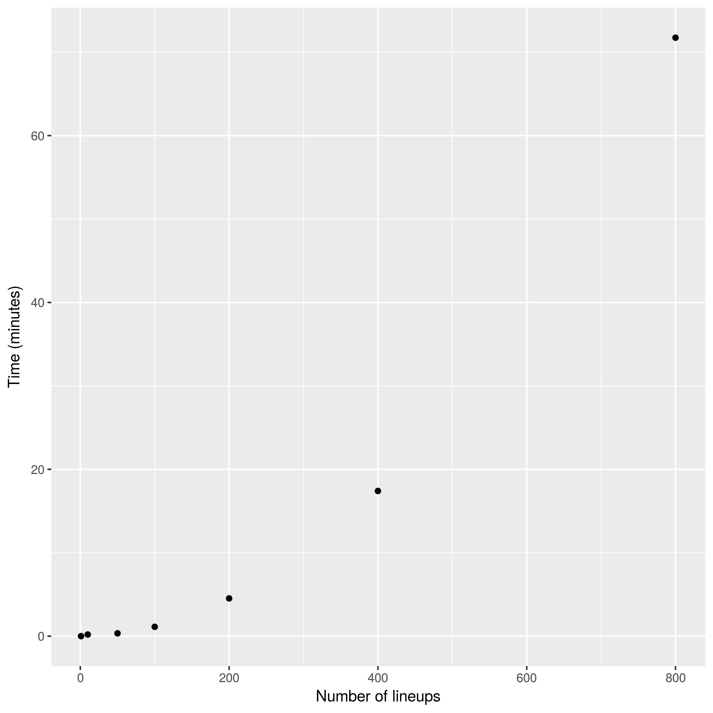

# Report
## Find the best lineup

Lineup Generator goal is to choose a subset of nine players in a set of players in order to respect some constraints and guarantee the best combination according some criteria. Because we are interested in finding the best solution from all feasible solutions, a natural way of looking to this problem is as an [optimization problem][optimization]. So it is possible to write the problem as a mathematical model and try to solve it using [mathematical integer program][ip] and very well consolidated tools/algorithms for optimization.

Before presenting the model, let's introduce some notation.
Consider  the set of players,  the set of teams and  the set of possible positions a player can assume. Each player  has some caracteristics like team, position, salary, ownership, score and so on.

Let's associate for each player  a binary variable , that assumes value 1 if player  is choose for the lineup and 0, otherwise.
Let's also associate for each team  a binary variable , that assumes value 1 if at least one player  of team  is choose for the lineup and 0, otherwise. This is a very important variable to impose some mandatory constraints to the problem.
Let's define  the necessary number of players for position  in a valid lineup.

The criteria used to evaluate the lineup is the player scores, so the objective function is to maximize the score sum for the nine selected players. The mathematical model that aims to find the best lineup possible is as following.

subject to

The objective function, as said before, is to maximize the score sum of the selected players. Constraints (1), (2) and (3) impose some bounds on salary and ownership of players. Constraints (4), (5) and (6) garantees that players from at least three teams will be selected in one lineup. Constraint (7) prevents that no more than four players from the same team will be selected. Constraint (8) tells how many players according to their positions will be selected. Constraint (9) impose the rule that no other player from the same team of the player in the D position can be selected.

## Generate many lineups

The section above presented a mathematical model to find the best possible lineup. However we are interested in generating many lineups 'a little' less valuable than the best that still feasible. We can achieve this in an interative manner, using the same model and adding new constraints as following.

Let  be the set of players of the best lineup given by the model above.
After finding , we add a new constraint to the model that turns  into a invalid lineup. We can achieve this by the constraint below.

This constraint says that at leat one player from  has to be different. So everytime the best lineup is found, we add the constraint of that lineup and solve the model again. We do this until we have a suficient number of  lineups.

## Perfomance

The lineup generator performance was measured in a machine with a Intel Core i5 CPU @ 2.67GHz and 4 GB of memory RAM, using the output of linux command `time`. The real time measured is reported in the graphic below for generating 1, 10, 50, 100, 200, 400 and 800. Notice that the runtime increase exponentially with the number of lineups.

It is worth to say that the solver used (CBC) doesn't have a good performance in comparison with other solvers, see the graphic below. Probably choose another solver can leverage the performance.

[ip]: https://en.wikipedia.org/wiki/Integer_programming "Integer Programming"
[optimization]: https://en.wikipedia.org/wiki/Optimization_problem "Optimization Problem"
